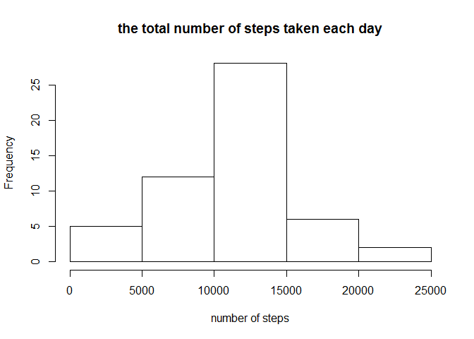
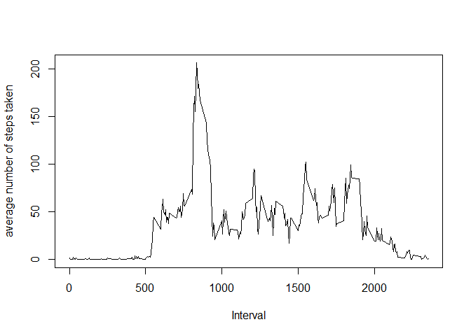
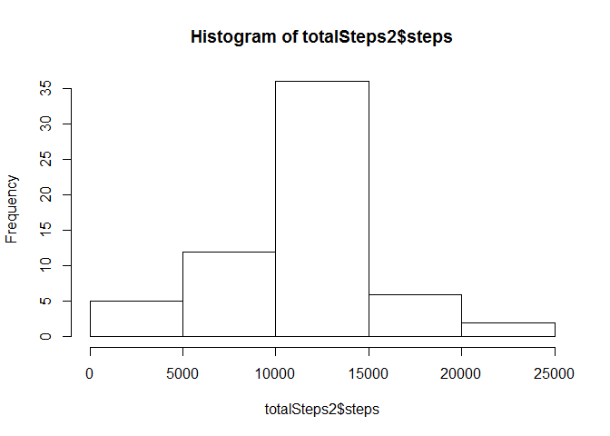

# Reproducible Research: Peer Assessment 1


## Loading and preprocessing the data

### Loading data


```r
library(data.table)
data <- fread("activity.csv", header = TRUE, stringsAsFactors = FALSE, na.strings = "NA")
data$date <- as.Date(data$date, format="%Y-%m-%d")
data$interval <- as.numeric(data$interval)
```


### removing NA

```r
dataWoNA <- data[!is.na(data$steps),]
```

## What is mean total number of steps taken per day?

### histogram


```r
library(plyr)
totalStepsDay <- ddply(dataWoNA, ~date, summarise, sum=sum(steps))
hist(totalStepsDay$sum, main = 'the total number of steps taken each day', xlab='number of steps')
```

 

### median and mean


```r
mean(totalStepsDay$sum)
```

```
## [1] 10766.19
```

```r
median(totalStepsDay$sum)
```

```
## [1] 10765
```

## What is the average daily activity pattern?


```r
meanSteps <- ddply(dataWoNA,~interval,summarise, mean_steps=mean(steps))
plot(meanSteps$interval, meanSteps$mean_steps, ylab = "average number of steps taken", xlab = "Interval", type = "l")
```

 


```r
maxSteps <- max(meanSteps$mean_steps)
theInterval <- meanSteps[meanSteps$mean_steps == maxSteps, 1]
```

5mI = 835

## Imputing missing values

There are 2304 missing rows.

Using meanSteps for an average number of steps and replace NA with that


```r
dataWiNA <- data
dataWiNA$steps <- mapply(function(steps, interval) 
            if (is.na(steps)) 
                meanSteps[meanSteps$interval == interval, 2]
            else
                steps, dataWiNA$steps, dataWiNA$interval)
```


```r
totalSteps2<-aggregate(steps~date,data=dataWiNA,sum)
hist(totalSteps2$steps)
```

 

```r
mean(totalSteps2$steps)
```

```
## [1] 10766.19
```

```r
median(totalSteps2$steps)
```

```
## [1] 10766.19
```
1.0766189\times 10^{4} steps.
1.0766189\times 10^{4} steps.

## Are there differences in activity patterns between weekdays and weekends?


```r
dataWiNA$day=ifelse(as.POSIXlt(as.Date(dataWiNA$date))$wday%%6==0,
                          "weekend","weekday")
# For Sunday and Saturday : weekend, Other days : weekday 
dataWiNA$day=factor(dataWiNA$day,levels=c("weekday","weekend"))
```


```r
stepsInterval2=aggregate(steps~interval+day,dataWiNA,mean)
library(lattice)
xyplot(steps~interval|factor(day),data=stepsInterval2,aspect=1/2,type="l")
```

 
